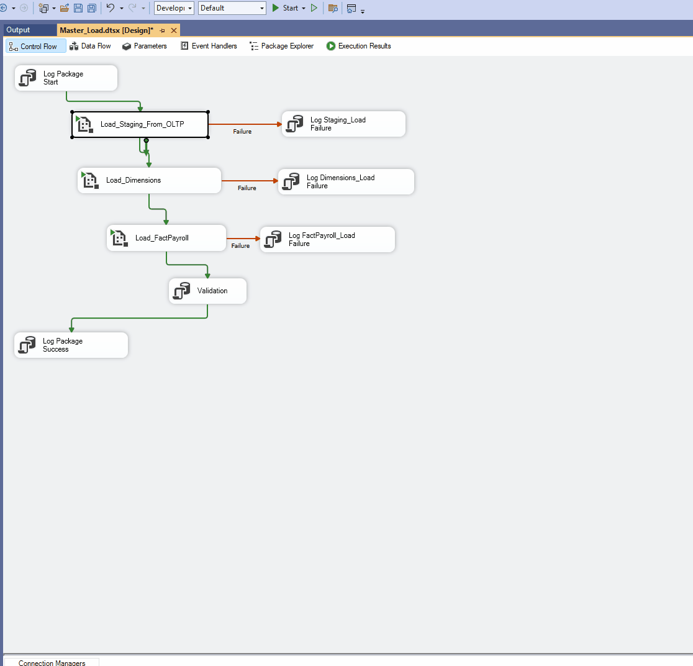

# Workforce Payroll Data Warehouse

## 📌 Project Summary
This project focuses on building a complete data pipeline to transform raw HR and payroll data into a structured data warehouse for reporting and analysis.

The solution includes ETL processes, data validation, logging, and a reporting layer to analyze payroll distribution, overtime usage, and monthly trends.

---

## 🧱 Project Workflow

1. Source Data (OLTP System)
2. Data Extraction into Staging (SSIS)
3. Transformation into Data Warehouse (Star Schema)
4. Validation & Quality Checks
5. Reporting with SSRS

---

## 🗄️ Data Model

The warehouse uses a star schema design:

- **Fact Table**
  - FactPayroll

- **Dimension Tables**
  - DimEmployee
  - DimDepartment
  - DimJobTitle
  - DimPayType
  - DimDate

---

## ⚙️ ETL Pipeline

The ETL process was built using SSIS and includes:

- Data extraction from OLTP system
- Loading into staging tables
- Transformation into dimension and fact tables
- Execution logging using `ETL_RunLog`
- Error handling and failure tracking

---

## ✅ Data Validation

To ensure data quality, the project includes:

- Row count comparisons (staging vs warehouse)
- Aggregate checks (Gross Pay, Net Pay)
- Foreign key validation
- End-to-end validation queries

---

## 📊 Reporting

An SSRS report was created to provide:

- Payroll by Department
- Overtime by Department
- Monthly Payroll Trends
- Department filter parameter

---

## 📸 Screenshots

### ETL Workflow

  

### Data Warehouse Output

  

### ETL Logging
![Run Log]

### Final Dashboard
![Report]

---

## 🎯 Outcome

This project demonstrates the ability to design and implement a full data pipeline, from raw data ingestion to reporting, using industry-standard tools.
